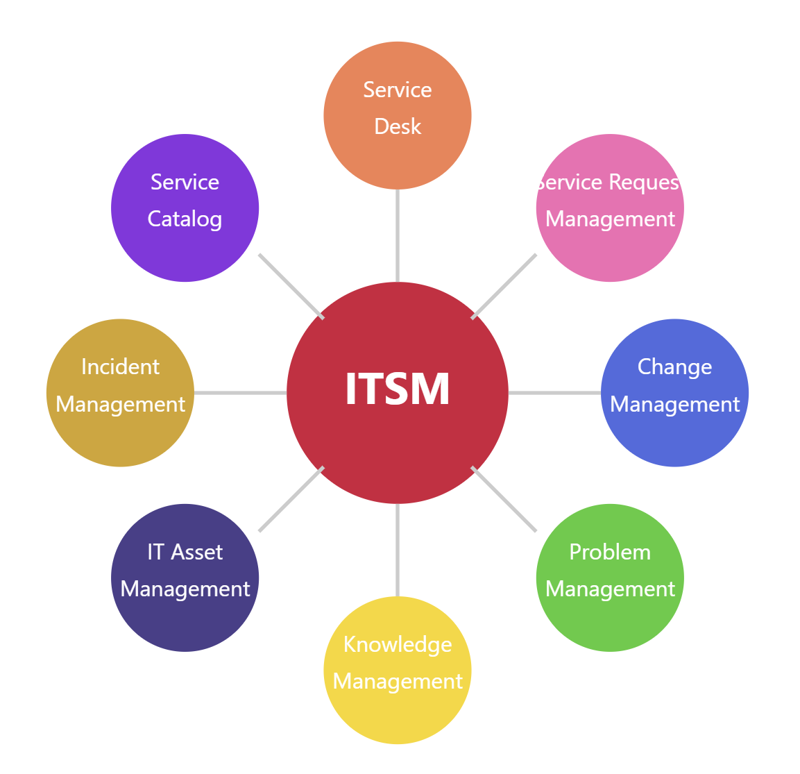

## $\color{red}{\textsf{Informieren}}$

| $\color{red}{\textsf{Arbeitspaket 1: Informieren}}$ - Was genau beinhaltet der Auftrag? |
| --------------------------------------------------------------------------------------- |
| Brainstorming/Online-Suche, Prüfkriterien definieren, Sachmittel aussuchen              |

### :mag: 1. Recherche; Brainstorming/Online-Suche

Zuerst habe ich mich online über Ticket-System Lösungen informiert, welche self-hosting unterstützen und essentielle ITSM-Funktionen nach ITIL beinhalten.

Die Kriterien
- Monitoringkompatibilität und einfache Integration der Monitoring-Funktionalitäten
- Self-Hosting und Orchestrierung (Dabei ist die Kompatibilität mit Docker-Compose wichtig) -> Klare Eingrenzung via SEUSAG
- Kostenloser Zugriff / Freie Lizenz
waren ebenfalls Bestandteil meiner Recherche.

*Folgende Lösungen habe ich in den Google-Suchergebnissen gefunden sowie von Benutzerempfehlungen auf Reddit.com:

| Potentielle Ticketsysteme aus meiner Online-Suche sind |
| ------------------------------------------------------ |
| -  OTRS                                                |
| - ZAMMAD                                               |
| - FREESCOUT                                            |

| Potentielle Monitoring-Lösungen aus meiner Online Suche |
| ------------------------------------------------------- |
| -  PASSLERS PRTG                                        |
| - ZABBIX MONITORING                                     |

### :scroll: 2. Prüfkriterien definieren

- Die Prüfkriterien für die Evaluation habe ich aus dem ITIL v4 Framework ausgesucht.

### :wrench: 3. Sachmittel aussuchen

Bei den Sachmittel für die Umsetzung habe ich mich an eine Cloud-Native Lösung Orientiert. Dabei habe ich mir **Docker** ausgesucht.
______
