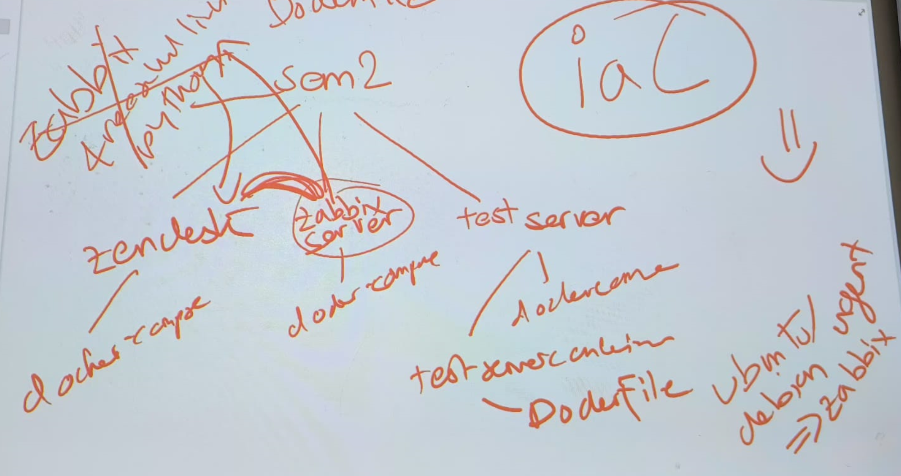
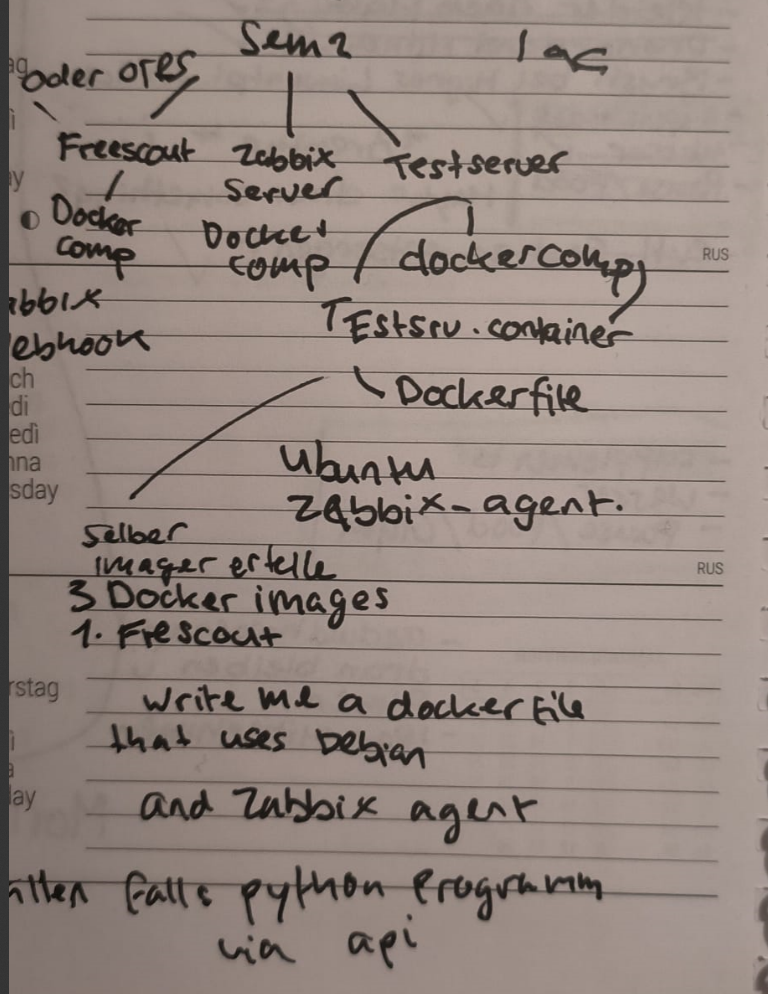

## $\color{red}{\textsf{Informieren}}$

| $\color{red}{\textsf{Arbeitspaket 1: Informieren}}$ - Was genau beinhaltet der Auftrag? |
| --------------------------------------------------------------------------------------- |
| Brainstorming/Online-Suche, Prüfkriterien definieren, Sachmittel aussuchen              |

### :mag: 1. Recherche; Brainstorming/Online-Suche

Zuerst habe ich mich online über Ticket-System Lösungen informiert, welche self-hosting unterstützen und essentielle ITSM-Funktionen nach ITIL beinhalten.

Die Kriterien:
- Monitoringkompatibilität und einfache Integration der Monitoring-Funktionalitäten
- Self-Hosting und Orchestrierung (Dabei ist die Kompatibilität mit Docker-Compose wichtig) -> Klare Eingrenzung via SEUSAG
- Kostenloser Zugriff / Freie Lizenz
waren ebenfalls Bestandteil meiner Recherche.

Zusammen mit Philipp Albrecht konnte ich eine erste Skizze der Struktur gestalten.
	 Bei diesen Skizzen ging es drum, eine Technische Struktur auszuarbeiten. Dabei wurden folgende Fragen gestellt:
- Auf welchem Cloud-Framework soll die Lösung basieren? -> Idealerweise nach iaC Philosophie im Docker. Ursprünglich war Hyper-V eine Idee, jedoch nicht Cloud-Ready.
- Wie können wir es Cloud-Ready und persistent machen? -> Durch Docker-Compose Files und Persistenz innerhalb der Docker-Compose Files.
- Wieviele Docker-Compose Files brauchen wir für die Lösung? -> Ursprünglich war ein einziges Docker-Compose File die Idee. Dies wäre zu Complex. Ich habe sie in der Konzipierung auf 3 geteilt für einfachere Orchestrierung.
- Wie arbeitet das Monitoring, der Testserver und das Ticketsystem zusammen? -> API/Webhook Kommunikation
- Wo müssen die benötigten Agents installiert werden? -> Ubuntu Server

*Sehr grob, es handelt sich lediglich um Ideen-Sammlung :grin: **

Die Suchergebnisse:
*Folgende Lösungen habe ich in den Google-Suchergebnissen gefunden sowie von Benutzerempfehlungen auf Reddit.com:

| Potentielle Ticketsysteme aus meiner Online-Suche sind |
| ------------------------------------------------------ |
| -  OTRS                                                |
| - ZAMMAD                                               |
| - FREESCOUT                                            |

| Potentielle Monitoring-Lösungen aus meiner Online Suche |
| ------------------------------------------------------- |
| -  PASSLERS PRTG                                        |
| - ZABBIX MONITORING                                     |
_____
### :scroll: 2. Prüfkriterien definieren

| 🤖 Disclamer: Diese Grafik durch Claude-AI gestützt                        |
| -------------------------------------------------------------------------- |
| [Siehe diesen Link für weitere Informationen](../Quellen_und_Disclamer.md) |
- Die Prüfkriterien für die Evaluation habe ich aus dem ITIL v4 Framework ausgesucht.
- Zudem war mir meine eigene ITIL-Zertifizierung sehr Hilfreich im Aufbau der Kriterien

Um eine präzisere Evaluation zu gewährleisten, habe ich innerhalb der Prüfkriterien, Kernkriterien hinzugefügt welche mit dem ITIL Framework korrelieren:

| ITSM-Funktion              | Kernfunktionen                              |
| -------------------------- | ------------------------------------------- |
| Incident Management        | Tickets, SLAs, Workflows, Multi-Channel     |
| Change Management          | Change-Tickets, Genehmigungen, Risikofelder |
| Problem Management         | Problem-Tickets, Incident-Linking, RCA      |
| Knowledge Management       | KB, Kategorien, Suche, Versionen            |
| IT Asset Management        | Asset-Tracking, Linking, Custom Fields      |
| Service Desk               | Multi-Channel, Portal, Routing, Tools       |
| Service Catalog            | Request-Forms, Kategorien, Portal           |
| Service Request Management | Formulare, Workflows, Genehmigungen         |

Damit Kommunikation innerhalb der Docker-Netzwerkstruktur und den Schnittstellen der potentiellen Lösungen funktionieren kann, habe ich zudem zusätzliche Evaluationskriterien definiert:

| Weitere Evaluationskriterien: |                                                                          |
| ----------------------------- | ------------------------------------------------------------------------ |
| - Docker-Kompatibilität       | Für Kompatibilität mit meiner Orchestrierung                             |
| - Agenten-Unterteilung        | Verschiedene ITSM-Agenten für verschiedene Prozesse und Zwecke erstellen |
| - Workflows                   | Für Automationsprozesse                                                  |
| - API-Funktionalität          | API-Zugriffe für ITSM und Monitoring                                     |

*Die vollumfängliche Evaluation ist unter IPERKA-SCHRITT PLANEN ersichtlich
- [MATRIX](../2_Planen/ITSM_Evaluation_Ticketsysteme.md)
____
### :wrench: 3. Sachmittel aussuchen

Bei den Sachmittel für die Umsetzung habe ich mich an eine Cloud-Native Lösung Orientiert. Dabei habe ich mir **Docker** ausgesucht, da Docker während unserer Weiterbildung im Modul zum Cloud-Native Engineer eingesetzt wird und sich für ähnliche Aufträge innerhalb des Moduls als optimal bewährt hat.

______
