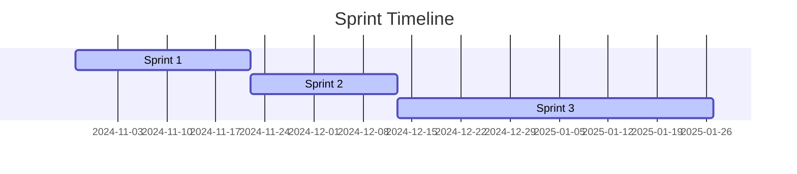

# Sprint und GANTT Zeitdiagramm
 
 ### :running: Sprint-Zeitplan

| :pushpin: Sprint-Phase 1                      | :pushpin: Sprint-Phase 2                                                                             | :pushpin: Sprint-Phase 3                            |
| --------------------------------------------- | ---------------------------------------------------------------------------------------------------- | --------------------------------------------------- |
| 28.10.24 - 22.11.24                           | 22.11.24 - 13.12.24                                                                                  | 13.12.24 - 27.1.25                                  |
| (Abbruch des Prozess aufgrund Projektwechsel) | Neu-Konzeption des Projektes, Auswahl der Technischen Mittel, Vorbereitung der Dokumentationssmittel | Technische Umsetzung und schriftliche Dokumentation |
|                                               | Arbeitspakete 1-3                                                                                    | Arbeitspakete 4-6                                   |
|                                               |                                                                                                      |                                                     |

-----

:information_source: Für live-Beschreibungen und Fortschritts Updates sowie Detaillierte Step-Checkliste zu meinen SPRINTS, siehe mein OneNote Notizbuch unter [Sprint Übersicht](onenote:https://tbzedu-my.sharepoint.com/personal/lilia_mechani_edu_tbz_ch/Documents/Semesterarbeit_2/Semesterarbeit_2/Neuer%20Abschnitt%201.one#Sprint%20Übersicht&section-id={CE589B69-7EAF-4A1A-875A-8E1A01B2A96B}&page-id={8AF6203E-F087-498B-A29F-B953D48F6FB2}&end)  ([Webansicht](https://tbzedu-my.sharepoint.com/personal/lilia_mechani_edu_tbz_ch/_layouts/OneNote.aspx?id=%2Fpersonal%2Flilia_mechani_edu_tbz_ch%2FDocuments%2FSemesterarbeit_2%2FSemesterarbeit_2&wd=target%28Neuer%20Abschnitt%201.one%7CCE589B69-7EAF-4A1A-875A-8E1A01B2A96B%2FSprint%20%C3%9Cbersicht%7C8AF6203E-F087-498B-A29F-B953D48F6FB2%2F%29))

---
###  :calendar: GANTT-Diagramm der Sprint-Zeitfenster

