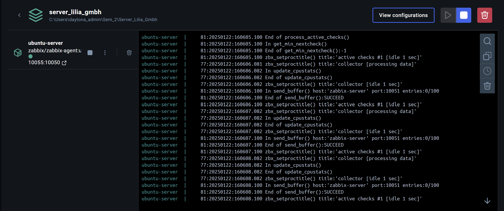
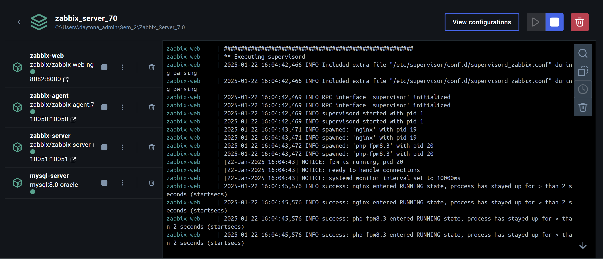

# Realisation

Technische Umsetzung:
## Docker-Composefiles

Das System wird via Docker aufgesetzt. Die 3 Elemente des Monitoring (Zabbix Monitoring, Zammad ITSM und mein Testserver) werden via Docker-Compose Files aufgesetzt.

Schlussendlich soll die Struktur so aussehen:
******************************** BILD EINFÜGEN!!!!!!!!!!!!!!!!!!!!!!!!!!!!!!!

Die Docker-Compose files beschreiben sich praktisch selbst.
Eines der wichtigsten Elemente im Compose-File der Zabbix installation ist die definition von **Networks.** Dabei wird das Netzwerk für die Docker-Umgebung definiert. 
	    networks:
      zabbix-net:
        ipv4_address: 172.20.0.4
        
Alle Docker-Compose Files richten sich nach der Netzwerk-Information, welche im **YAML** des Zabbix Server definiert ist.

	Damit Zabbix auch vollständige Funktionstüchtigkeit hat,muss das Dockercompose Container für nginx, Agent, Server und mysql Datenbank erstellen.
	
- ***Docker Compose Zabbix***
```yaml
version: '3.8'

services:
  mysql-server:
    image: mysql:8.0-oracle
    container_name: mysql-server
    command: --character-set-server=utf8 --collation-server=utf8_bin --default-authentication-plugin=mysql_native_password
    environment:
      MYSQL_DATABASE: zabbix
      MYSQL_USER: zabbix
      MYSQL_PASSWORD: zabbix
      MYSQL_ROOT_PASSWORD: root_pwd
    volumes:
      - mysql-data:/var/lib/mysql
    networks:
      zabbix-net:
        ipv4_address: 172.20.0.2

  zabbix-server:
    image: zabbix/zabbix-server-mysql:7.0-ubuntu-latest  # Updated to Zabbix 7.0
    container_name: zabbix-server
    environment:
      DB_SERVER_HOST: mysql-server
      MYSQL_DATABASE: zabbix
      MYSQL_USER: zabbix
      MYSQL_PASSWORD: zabbix
      MYSQL_ROOT_PASSWORD: root_pwd
      ZBX_STARTPOLLERS: "5"
      ZBX_IPMIPOLLERS: "0"
    ports:
      - "10051:10051"
    depends_on:
      - mysql-server
    networks:
      zabbix-net:
        ipv4_address: 172.20.0.3

  zabbix-web:
    image: zabbix/zabbix-web-nginx-mysql:7.0-ubuntu-latest  # Updated to Zabbix 7.0
    container_name: zabbix-web
    environment:
      ZBX_SERVER_HOST: zabbix-server
      DB_SERVER_HOST: mysql-server
      MYSQL_DATABASE: zabbix
      MYSQL_USER: zabbix
      MYSQL_PASSWORD: zabbix
      MYSQL_ROOT_PASSWORD: root_pwd
      PHP_TZ: America/New_York
    ports:
      - "8082:8080"
    depends_on:
      - mysql-server
      - zabbix-server
    networks:
      zabbix-net:
        ipv4_address: 172.20.0.4

  zabbix-agent:
    image: zabbix/zabbix-agent:7.0-ubuntu-latest  # Updated to Zabbix 7.0
    container_name: zabbix-agent
    privileged: true
    environment:
      ZBX_HOSTNAME: "Zabbix server"
      ZBX_SERVER_HOST: zabbix-server
      ZBX_SERVER_PORT: 10051
      ZBX_PASSIVE_ALLOW: true
      ZBX_ACTIVE_ALLOW: true
    ports:
      - "10050:10050"
    depends_on:
      - zabbix-server
    networks:
      zabbix-net:
        ipv4_address: 172.20.0.5
    volumes:
      - /etc/localtime:/etc/localtime:ro
      - /etc/timezone:/etc/timezone:ro

networks:
  zabbix-net:
    driver: bridge
    ipam:
      config:
        - subnet: 172.20.0.0/16
          gateway: 172.20.0.1

volumes:
  mysql-data:
    driver: local

```
___
	Im Docker-Compose File des Ubuntu Server wird die Zugehörigkeit zum zabbix-net Netzwerk beschrieben. Zudem wird ein Zabbix-Agent installiert. Der Zabbix Agent dient zur Verbindung zum Zabbix Server.
	
- ***Docker Compose Ubuntu Server***
```yaml
version: '3.8'
services:
  ubuntu-server:
    image: zabbix/zabbix-agent:ubuntu-6.4-latest
    container_name: ubuntu-server
    hostname: ubuntu-server
    restart: unless-stopped
    privileged: true
    ports:
      - "10055:10050"
    environment:
      - ZBX_HOSTNAME=ubuntu-server
      - ZBX_SERVER_HOST=zabbix-server
      - ZBX_SERVER_PORT=10051
      - ZBX_PASSIVE_ALLOW=true
      - ZBX_ACTIVE_ALLOW=true
      - ZBX_DEBUGLEVEL=4
    networks:
      - zabbix-net

networks:
  zabbix-net:
    external: true
    name: zabbix_server_70_zabbix-net
```
---
	Das Zammad Docker-Compose File ist das grösste File in diesem Projekt.
	Für grundlegene Funktionalitäten sowie schnellere Suche innerhalb des Ticketsystems werden verschiedene Container dazuinstalliert.
	- Elasticsearch dient zu effizienterer Suchfunktion innerhalb des Ticketsystems
	- Der Scheduler dient zur Kommunikation zu anderen Systemen, welche sich via API mit dem System austauschen. Ohne den Scheduler Funktioneren Automationen im Ticketsystem via API nicht. Jedoch ist das Ticketsystem auch ohne Scheduler funktionstüchtig.
- ***Docker Compose Zammad***
```yaml
version: '3.3'
services:
  zammad-postgresql:
    image: postgres:15.4
    container_name: zammad-postgresql
    environment:
      - POSTGRES_USER=zammad
      - POSTGRES_PASSWORD=zammad
      - POSTGRES_DB=zammad
      - POSTGRES_MAX_CONNECTIONS=100
      - POSTGRES_SHARED_BUFFERS=256MB
    command: 
      - "postgres"
      - "-c"
      - "max_connections=100"
    volumes:
      - postgres-data:/var/lib/postgresql/data
    networks:
      - zabbix-net

  zammad-elasticsearch:
    image: elasticsearch:7.17.9
    container_name: zammad-elasticsearch
    environment:
      - discovery.type=single-node
      - "ES_JAVA_OPTS=-Xms512m -Xmx512m"
    volumes:
      - elasticsearch-data:/usr/share/elasticsearch/data
    networks:
      - zabbix-net

  zammad-redis:
    image: redis:7.0
    container_name: zammad-redis
    command: redis-server --save "" --appendonly no
    networks:
      - zabbix-net

  zammad-init:
    image: zammad/zammad-docker-compose:latest
    container_name: zammad-init
    command: ["zammad-init"]
    depends_on:
      - zammad-postgresql
      - zammad-elasticsearch
      - zammad-redis
    environment:
      - POSTGRESQL_HOST=zammad-postgresql
      - POSTGRESQL_USER=zammad
      - POSTGRESQL_PASS=zammad
      - ELASTICSEARCH_HOST=zammad-elasticsearch
      - ELASTICSEARCH_PORT=9200
      - REDIS_URL=redis://zammad-redis:6379
      - ZAMMAD_RAILSSERVER_HOST=zammad-railsserver
    networks:
      - zabbix-net

  zammad-railsserver:
    image: zammad/zammad-docker-compose:latest
    container_name: zammad-railsserver
    command: ["zammad-railsserver"]
    depends_on:
      - zammad-postgresql
      - zammad-elasticsearch
      - zammad-redis
    environment:
      - POSTGRESQL_HOST=zammad-postgresql
      - POSTGRESQL_USER=zammad
      - POSTGRESQL_PASS=zammad
      - ELASTICSEARCH_HOST=zammad-elasticsearch
      - ELASTICSEARCH_PORT=9200
      - REDIS_URL=redis://zammad-redis:6379
    networks:
      - zabbix-net

  zammad-scheduler:
    image: zammad/zammad-docker-compose:latest
    container_name: zammad-scheduler
    command: ["zammad-scheduler"]
    depends_on:
      - zammad-railsserver
    environment:
      - POSTGRESQL_HOST=zammad-postgresql
      - POSTGRESQL_USER=zammad
      - POSTGRESQL_PASS=zammad
      - POSTGRESQL_OPTIONS=?pool=50
      - ELASTICSEARCH_HOST=zammad-elasticsearch
      - ELASTICSEARCH_PORT=9200
      - REDIS_URL=redis://zammad-redis:6379
    networks:
      - zabbix-net

  zammad-websocket:
    image: zammad/zammad-docker-compose:latest
    container_name: zammad-websocket
    command: ["zammad-websocket"]
    depends_on:
      - zammad-railsserver
    environment:
      - POSTGRESQL_HOST=zammad-postgresql
      - POSTGRESQL_USER=zammad
      - POSTGRESQL_PASS=zammad
      - ELASTICSEARCH_HOST=zammad-elasticsearch
      - ELASTICSEARCH_PORT=9200
      - REDIS_URL=redis://zammad-redis:6379
    networks:
      - zabbix-net

  zammad-nginx:
    image: zammad/zammad-docker-compose:latest
    container_name: zammad-nginx
    command: ["zammad-nginx"]
    depends_on:
      - zammad-railsserver
    ports:
      - "8083:8080"
    environment:
      - NGINX_SERVER_SCHEME=http
      - NGINX_SERVER_NAME=localhost
      - REDIS_URL=redis://zammad-redis:6379
    networks:
      - zabbix-net

networks:
  zabbix-net:
    external: true
    name: zabbix_server_70_zabbix-net

volumes:
  postgres-data:
  elasticsearch-data:

```


Compose-Errors beseitigen

___
	Die Docker Container werden via *docker compose up -d hochgefahren

### Server OK
- Zabbix Agent OK


### Monitoring OK

nginx: OK
Agent: OK
Server: OK
mysql Datenbank: ok
### Ticketsystem: OK
![[../_attachments/4_zammad_ok.png]]
- Websocket: OK
- nginx: OK
- Scheduler: Aktiv
- Zammad-Init: Complete
- Railsserver: OK
- Elasticsearch: OK
- Redis: OK
- Postgresql: OK

___
## Docker-Check

Docker-Environment steht.

Monitoring Implementiert

Ticketsystem Implementiert

Test-Ubuntu-Server Implementiert
___
## Connectivity Check

Ping Ubuntu -> Zabbix ![[../_attachments/6_ping_server_zu_zabbix.png]]

Ping Zabbix->zammad

Ping Zabbix->ubuntu

Ping Zammad->Zabbix

Ping Zammad->ubuntu
___
## Alerting via Webhook zu Zammad

API Token erstellt

Alerting User für Zammad

API im Zabbix implementiert

Action hinzugefügt

Sendung des Tickets
