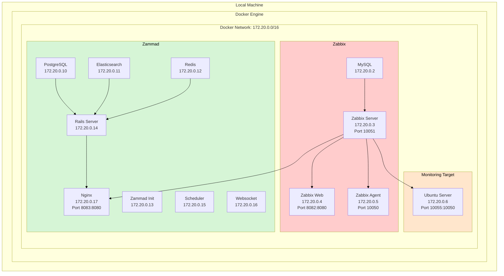
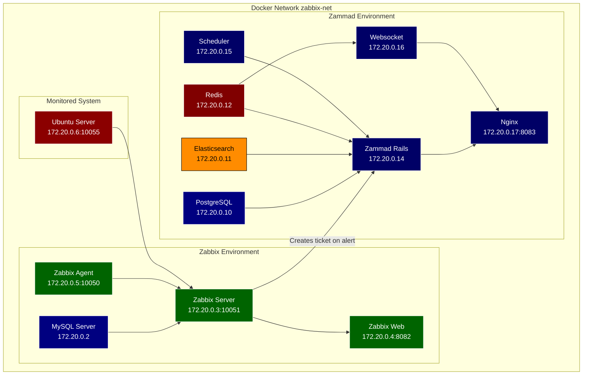

Seusag / Netzwerkübersicht

| 🤖 Disclamer: Diese Grafik durch Claude-AI gestützt                        |
| -------------------------------------------------------------------------- |
| [Siehe diesen Link für weitere Informationen](../Quellen_und_Disclamer.md) |

