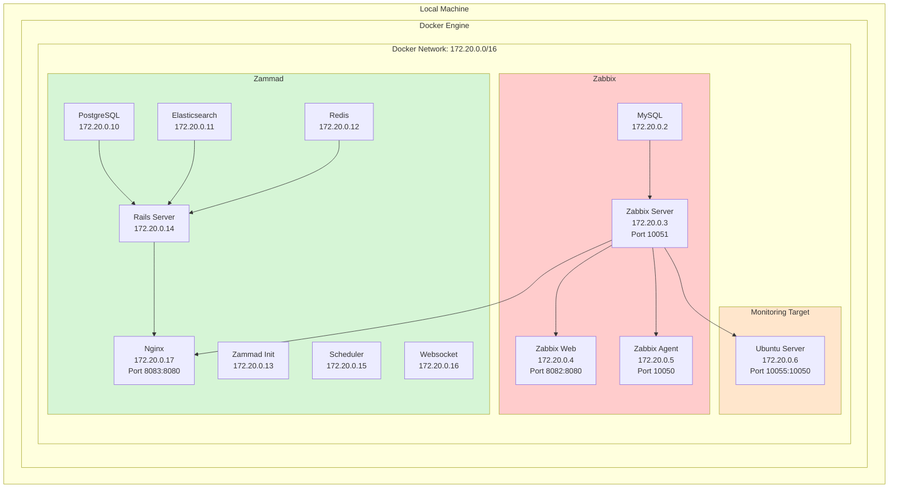

Seusag / Netzwerkübersicht

```Mermaid


```

```mermaid
graph TB
    subgraph Host[Local Machine]
        subgraph Docker[Docker Engine]
            subgraph Network [Docker Network: 172.20.0.0/16]
                subgraph Zabbix[Zabbix]
                    style Zabbix fill:#ffcccc
                    mysql[MySQL<br>172.20.0.2]
                    zserver[Zabbix Server<br>172.20.0.3<br>Port 10051]
                    zweb[Zabbix Web<br>172.20.0.4<br>Port 8082:8080]
                    zagent[Zabbix Agent<br>172.20.0.5<br>Port 10050]
                end
                
                subgraph Target[Monitoring Target]
                    style Target fill:#ffe6cc
                    ubuntu[Ubuntu Server<br>172.20.0.6<br>Port 10055:10050]
                end
                
                subgraph Zammad[Zammad]
                    style Zammad fill:#d6f5d6
                    postgres[PostgreSQL<br>172.20.0.10]
                    elastic[Elasticsearch<br>172.20.0.11]
                    redis[Redis<br>172.20.0.12]
                    init[Zammad Init<br>172.20.0.13]
                    rails[Rails Server<br>172.20.0.14]
                    scheduler[Scheduler<br>172.20.0.15]
                    websocket[Websocket<br>172.20.0.16]
                    nginx[Nginx<br>172.20.0.17<br>Port 8083:8080]
                end
            end
        end
    end
    
    %% Main Service Connections
    zserver --> ubuntu
    zserver --> nginx
    
    %% Internal Zabbix Connections
    mysql --> zserver
    zserver --> zweb
    zserver --> zagent
    
    %% Internal Zammad Connections
    postgres & elastic & redis --> rails
    rails --> nginx
```