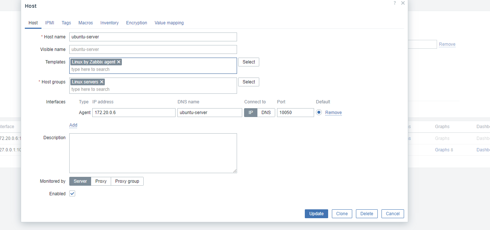
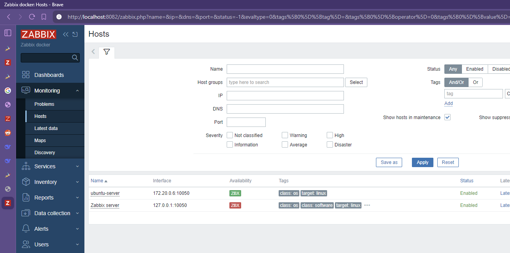
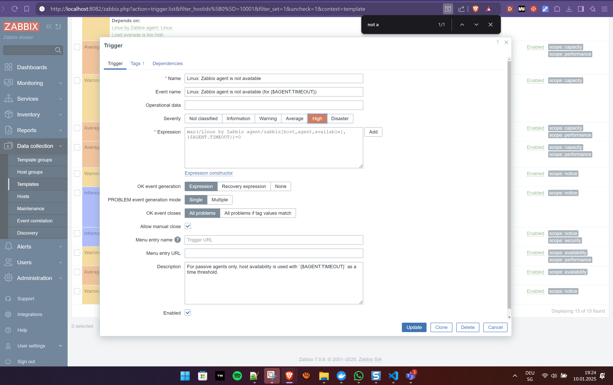
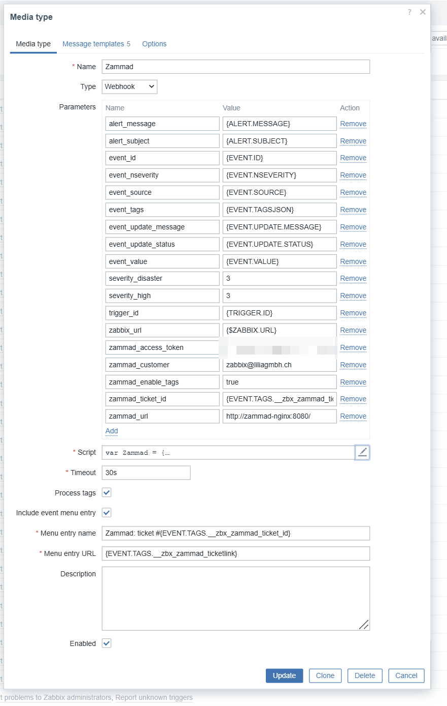

## 1. Beschreibung Zabbix

| 🤖 Disclamer: Dieser Code wurde durch Claude-AI gestützt                   |
| -------------------------------------------------------------------------- |
| [Siehe diesen Link für weitere Informationen](../Quellen_und_Disclamer.md) |

Das Zabbix-YAML konfiguriert vier Hauptdienste:

1. `mysql-server`: Datenbankserver für Zabbix mit UTF-8 Kodierung
2. `zabbix-server`: Kernkomponente, verarbeitet Monitoring-Daten, kommuniziert über Port 10051
3. `zabbix-web`: Webinterface mit Nginx, erreichbar über Port 8082
4. `zabbix-agent`: Monitoring-Agent für den Zabbix-Server selbst, läuft auf Port 10050

Alle Dienste sind im Netzwerk `zabbix-net` (172.20.0.0/16) mit festen IPs verbunden. Persistente Daten werden in Docker-Volumes gespeichert.

Die Konfiguration verwendet Zabbix 7.0 mit Ubuntu-basierten Images und MySQL 8.0 als Datenbank.

---


Eines der wichtigsten Elemente im Compose-File der Zabbix installation ist die definition von **Networks.** Dabei wird das Netzwerk für die Docker-Umgebung definiert. 
	    networks:
      zabbix-net:
        ipv4_address: 172.20.0.4
        
Alle Docker-Compose Files richten sich nach der Netzwerk-Information, welche im **YAML** des Zabbix Server definiert ist.

	Damit Zabbix auch vollständige Funktionstüchtigkeit hat,muss das Dockercompose Container für nginx, Agent, Server und mysql Datenbank erstellen.

```yaml
version: '3.8'

  

services:

  mysql-server:

    image: mysql:8.0-oracle

    container_name: mysql-server

    command: --character-set-server=utf8 --collation-server=utf8_bin --default-authentication-plugin=mysql_native_password

    environment:

      MYSQL_DATABASE: zabbix

      MYSQL_USER: zabbix

      MYSQL_PASSWORD: zabbix

      MYSQL_ROOT_PASSWORD: root_pwd

    volumes:

      - mysql-data:/var/lib/mysql

    networks:

      zabbix-net:

        ipv4_address: 172.20.0.2

  

  zabbix-server:

    image: zabbix/zabbix-server-mysql:7.0-ubuntu-latest

    container_name: zabbix-server

    environment:

      DB_SERVER_HOST: mysql-server

      MYSQL_DATABASE: zabbix

      MYSQL_USER: zabbix

      MYSQL_PASSWORD: zabbix

      MYSQL_ROOT_PASSWORD: root_pwd

      ZBX_STARTPOLLERS: "5"

      ZBX_IPMIPOLLERS: "0"

    volumes:

      - zabbix-server-data:/var/lib/zabbix

      - zabbix-server-conf:/etc/zabbix

    ports:

      - "10051:10051"

    depends_on:

      - mysql-server

    networks:

      zabbix-net:

        ipv4_address: 172.20.0.3

  

  zabbix-web:

    image: zabbix/zabbix-web-nginx-mysql:7.0-ubuntu-latest

    container_name: zabbix-web

    environment:

      ZBX_SERVER_HOST: zabbix-server

      DB_SERVER_HOST: mysql-server

      MYSQL_DATABASE: zabbix

      MYSQL_USER: zabbix

      MYSQL_PASSWORD: zabbix

      MYSQL_ROOT_PASSWORD: root_pwd

      PHP_TZ: America/New_York

    ports:

      - "8082:8080"

    depends_on:

      - mysql-server

      - zabbix-server

    networks:

      zabbix-net:

        ipv4_address: 172.20.0.4

  

  zabbix-agent:

    image: zabbix/zabbix-agent:7.0-ubuntu-latest

    container_name: zabbix-agent

    privileged: true

    environment:

      ZBX_HOSTNAME: "Zabbix server"

      ZBX_SERVER_HOST: zabbix-server

      ZBX_SERVER_PORT: 10051

      ZBX_PASSIVE_ALLOW: true

      ZBX_ACTIVE_ALLOW: true

    ports:

      - "10050:10050"

    depends_on:

      - zabbix-server

    networks:

      zabbix-net:

        ipv4_address: 172.20.0.5

    volumes:

      - /etc/localtime:/etc/localtime:ro

      - /etc/timezone:/etc/timezone:ro

  

networks:

  zabbix-net:

    driver: bridge

    ipam:

      config:

        - subnet: 172.20.0.0/16

          gateway: 172.20.0.1

  

volumes:

  mysql-data:

    driver: local

  zabbix-server-data:

    driver: local

  zabbix-server-conf:

    driver: local
```

## 2. Setup von Zabbix

### 2.1 Initiales Setup
Der Server ist an sich bereits initialisiert.
Im ersten Schritt muss man lediglich einen Benutzer hinzufügen

### 2.2 Hinzufügen des Ubuntu Server Hosts und Trigger anpassen
Da sich der Ubuntu Server im gleichen Netz befindet, hat Zabbix den Host automatisch gefunden.
Ich musste danach lediglich den Host in eine Hostgruppe hinzufügen, damit der Host im Monitoring korrekt aufgelistet wird:

(Wichtig dabei ist es den Hostnamen des Docker-Containers unter DNS Name hinzuzufügen)



Unter dem Trigger "Zabbix Agent not available", habe ich eine Priotität gesetzt, damit das Event die richtige Severity bei einem Timeout im System anzeigt

### 2.3 Einrichten des Alerting via API Webhook (Vollständige Anleitung)

Technische Quelle (Ab Abschnitt Zabbix Webhook Configuration):
https://www.zabbix.com/de/integrations/zammad

Meine Mediatype-Konfiguration:



Meine Action-Konfiguration:


Meine User-Konfiguration:

Mein Globales Macro:
