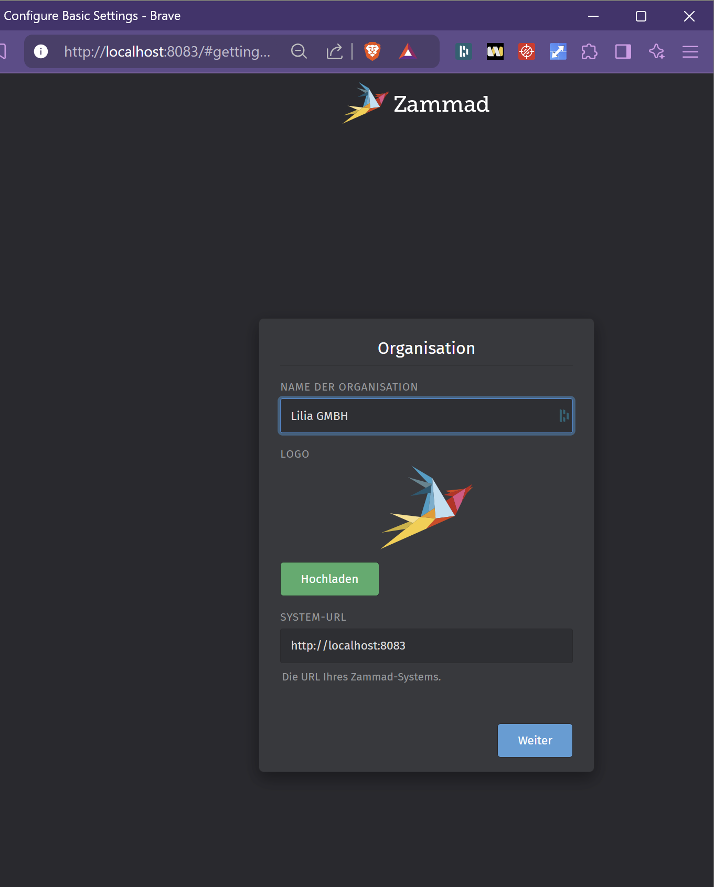

## 1. Beschreibung Zammad
| 🤖 Disclamer: Dieser Code wurde durch Claude-AI gestützt                   |
| -------------------------------------------------------------------------- |
| [Siehe diesen Link für weitere Informationen](../Quellen_und_Disclamer.md) |

Das Zammad Docker-Compose File ist das grösste File in diesem Projekt.
Für grundlegene Funktionalitäten sowie schnellere Suche innerhalb des Ticketsystems werden verschiedene Container dazuinstalliert.

Das Zammad-YAML setzt sieben Container auf:

1. `zammad-postgresql`: Postgres 15.4 als Hauptdatenbank
2. `zammad-elasticsearch`: Elasticsearch für Suchfunktionen
3. `zammad-redis`: Redis für Caching
4. `zammad-init`: Initialisiert die Zammad-Installation
5. `zammad-railsserver`: Rails-Anwendungsserver
6. `zammad-websocket`: WebSocket-Server für Echtzeitkommunikation
7. `zammad-nginx`: Nginx als Webserver, erreichbar über Port 8083

Alle Dienste nutzen das bestehende Zabbix-Netzwerk (`zabbix-net`) mit festen IPs. Daten werden in vier Volumes gespeichert. Die Container sind miteinander verknüpft und teilen Umgebungsvariablen für Datenbankzugriff und Service-Discovery.

---


- Elasticsearch dient zu effizienterer Suchfunktion innerhalb des Ticketsystems
- Der Scheduler dient zur Kommunikation zu anderen Systemen, welche sich via API mit dem System austauschen. Ohne den Scheduler Funktioneren Automationen im Ticketsystem via API nicht. Jedoch ist das Ticketsystem auch ohne Scheduler funktionstüchtig.


```yaml
version: '3.3'

services:

  zammad-postgresql:

    image: postgres:15.4

    container_name: zammad-postgresql

    environment:

      - POSTGRES_USER=zammad

      - POSTGRES_PASSWORD=zammad

      - POSTGRES_DB=zammad

      - POSTGRES_MAX_CONNECTIONS=100

      - POSTGRES_SHARED_BUFFERS=256MB

    command:

      - "postgres"

      - "-c"

      - "max_connections=100"

    volumes:

      - postgres-data:/var/lib/postgresql/data

    networks:

      zabbix-net:

        ipv4_address: 172.20.0.10

  

  zammad-elasticsearch:

    image: elasticsearch:7.17.9

    container_name: zammad-elasticsearch

    environment:

      - discovery.type=single-node

      - "ES_JAVA_OPTS=-Xms512m -Xmx512m"

    volumes:

      - elasticsearch-data:/usr/share/elasticsearch/data

    networks:

      zabbix-net:

        ipv4_address: 172.20.0.11

  

  zammad-redis:

    image: redis:7.0

    container_name: zammad-redis

    command: redis-server --save "" --appendonly no

    networks:

      zabbix-net:

        ipv4_address: 172.20.0.12

  

  zammad-init:

    image: zammad/zammad-docker-compose:latest

    container_name: zammad-init

    command: ["zammad-init"]

    depends_on:

      - zammad-postgresql

      - zammad-elasticsearch

      - zammad-redis

    environment:

      - POSTGRESQL_HOST=zammad-postgresql

      - POSTGRESQL_USER=zammad

      - POSTGRESQL_PASS=zammad

      - ELASTICSEARCH_HOST=zammad-elasticsearch

      - ELASTICSEARCH_PORT=9200

      - REDIS_URL=redis://zammad-redis:6379

      - ZAMMAD_RAILSSERVER_HOST=zammad-railsserver

    volumes:

      - zammad-data:/opt/zammad

      - zammad-backup:/var/tmp/zammad

    networks:

      zabbix-net:

        ipv4_address: 172.20.0.13

  

  zammad-railsserver:

    image: zammad/zammad-docker-compose:latest

    container_name: zammad-railsserver

    command: ["zammad-railsserver"]

    depends_on:

      - zammad-postgresql

      - zammad-elasticsearch

      - zammad-redis

    environment:

      - POSTGRESQL_HOST=zammad-postgresql

      - POSTGRESQL_USER=zammad

      - POSTGRESQL_PASS=zammad

      - ELASTICSEARCH_HOST=zammad-elasticsearch

      - ELASTICSEARCH_PORT=9200

      - REDIS_URL=redis://zammad-redis:6379

    volumes:

      - zammad-data:/opt/zammad

      - zammad-backup:/var/tmp/zammad

    networks:

      zabbix-net:

        ipv4_address: 172.20.0.14

  

  zammad-scheduler:

    image: zammad/zammad-docker-compose:latest

    container_name: zammad-scheduler

    command: ["zammad-scheduler"]

    depends_on:

      - zammad-railsserver

    environment:

      - POSTGRESQL_HOST=zammad-postgresql

      - POSTGRESQL_USER=zammad

      - POSTGRESQL_PASS=zammad

      - POSTGRESQL_OPTIONS=?pool=50

      - ELASTICSEARCH_HOST=zammad-elasticsearch

      - ELASTICSEARCH_PORT=9200

      - REDIS_URL=redis://zammad-redis:6379

    volumes:

      - zammad-data:/opt/zammad

      - zammad-backup:/var/tmp/zammad

    networks:

      zabbix-net:

        ipv4_address: 172.20.0.15

  

  zammad-websocket:

    image: zammad/zammad-docker-compose:latest

    container_name: zammad-websocket

    command: ["zammad-websocket"]

    depends_on:

      - zammad-railsserver

    environment:

      - POSTGRESQL_HOST=zammad-postgresql

      - POSTGRESQL_USER=zammad

      - POSTGRESQL_PASS=zammad

      - ELASTICSEARCH_HOST=zammad-elasticsearch

      - ELASTICSEARCH_PORT=9200

      - REDIS_URL=redis://zammad-redis:6379

    volumes:

      - zammad-data:/opt/zammad

      - zammad-backup:/var/tmp/zammad

    networks:

      zabbix-net:

        ipv4_address: 172.20.0.16

  

  zammad-nginx:

    image: zammad/zammad-docker-compose:latest

    container_name: zammad-nginx

    command: ["zammad-nginx"]

    depends_on:

      - zammad-railsserver

    ports:

      - "8083:8080"

    environment:

      - NGINX_SERVER_SCHEME=http

      - NGINX_SERVER_NAME=localhost

      - REDIS_URL=redis://zammad-redis:6379

    volumes:

      - zammad-data:/opt/zammad

      - zammad-backup:/var/tmp/zammad

    networks:

      zabbix-net:

        ipv4_address: 172.20.0.17

  

networks:

  zabbix-net:

    external: true

    name: zabbix_server_70_zabbix-net

  

volumes:

  postgres-data:

  elasticsearch-data:

  zammad-data:

  zammad-backup:
```

## 2. Setup von Zammad

### 2.1 Initiales Setup des Ticketsystems

Beim Setup habe ich lediglich den Initialen Namen für meine Organisation und einen User angelegt. -> Dies kann man individuell gestalten.
Jegliche weitere Schritte sind nicht relevant und kann man überspringen


### 2.2 Setup des Alerting via API-Webhook (Vollständige Anleitung)

Technische Quelle:
https://www.zabbix.com/de/integrations/zammad