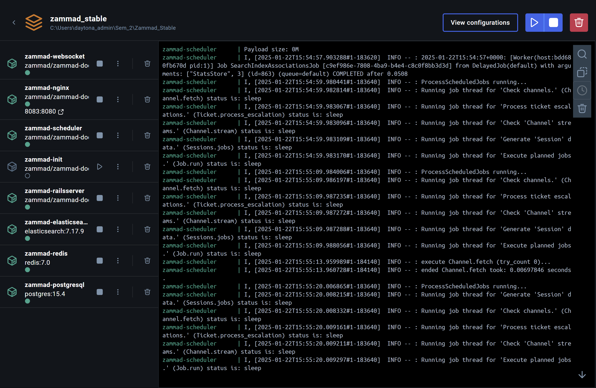

## $\color{cyan}{\textsf{Kontrollieren}}$
| $\color{cyan}{\textsf{Arbeitspaket 5: Kontrollieren}}$ - Wurde der Auftrag korrekt umgesetzt? |
| --------------------------------------------------------------------------------------------- |
| Testing der Umgebung                                                                          |
### :flashlight: 1. Kontrolle der folgenden Punkte:

### :wrench: Aktivität der Services

Damit ich sicherstellen kann, das alle Elemente des Monitoring funktionieren muss ich kontrollieren, ob alle Docker Aktiv sind und die einzelnen Services keine Error-Messages generieren:

*Aktivität des Ubuntu Server (Monitoring Target):
- Zabbix Agent OK


*Aktivität des Zabbix Monitoring:


- nginx: OK -> WEBGUI ERREICHBAR
- Agent: OK
- Server: OK
- mysql Datenbank: ok

*Aktivität des Zammad ITSM:


- Websocket: OK
- nginx: OK -> WEBGUI ERREICHBAR
- Scheduler: Aktiv
- Zammad-Init: Complete
- Railsserver: OK
- Elasticsearch: OK
- Redis: OK
- Postgresql: OK


:white_check_mark: Zammad sowie Zabbix sind via WebGUI erreichbar
____

### :wrench: Connectivity

Um die Connectivity in meinem Docker-Netzwerk zu testen, wird Zabbix Monitoring den Zammad nginx sowie den Ubuntu Server anpingen.

**Ping Zabbix->zammad nginx
`docker exec -it zabbix-server ping zammad-nginx`


**Ping Zabbix->ubuntu server
`docker exec -it zabbix-server ping ubuntu-server`


Ping Tests von den anderen Mitgliedern nicht nötig. Wichtig ist, das Zabbix alle Teilnehmer sieht.

:white_check_mark: Connectivity steht
___

### :wrench: Persistenz
Zabbix:
- ✓ Sicher - Alle Daten (MySQL, Server-Konfiguration, Server-Daten) werden in persistenten Volumes gespeichert
```yaml
volumes:
  - zabbix-server-data:/var/lib/zabbix
  - zabbix-server-conf:/etc/zabbix

volumes:
  zabbix-server-data:
    driver: local
  zabbix-server-conf:
    driver: local
```

Zammad:
- ✓ Sicher - Alle kritischen Daten (PostgreSQL, Elasticsearch, Anwendungsdaten, Backups) nutzen persistente Volumes
```yaml
volumes:
  - zammad-data:/opt/zammad
  - zammad-backup:/var/tmp/zammad

volumes:
  postgres-data:
  elasticsearch-data:
  zammad-data:
  zammad-backup:
```

Ubuntu Server:
- ✓ Sicher - Keine persistenten Daten zu verlieren, nur Konfiguration in der Compose-Datei. Fixe IP-Adresse und MAC-Adresse definiert.
```yaml

    mac_address: 02:42:ac:14:00:06
    
# und fixe IP-Adresse

    networks:

      zabbix-net:

        ipv4_address: 172.20.0.6
```

Die Volumes bleiben nach `docker compose down` erhalten. Sie werden jedoch gelöscht, wenn ich`docker compose down -v` verwende.

Um die Persistenz vollständig auf ihre härte zu testen, werde ich die Konfiguration Abschliessen, alle Monitoring Elemente via `docker compose down` herunternehmen und anschliessend via `docker compose up` wieder initialisieren und herauffahren.

Die Container dürfen bei einem Erfolgreichen Resultat ihre Konfiguration nicht verlieren:

`docker compose down` von Zabbix:


`docker compose down` des Lilia GMBH Ubuntu Server:


`docker compose down` von Zammad:


Konfiguration sieht identisch aus wie vor dem Prozess:


:white_check_mark: Persistenz gewährleistet
____

### :wrench: Auslösen des Alarms
Um meine Umgebung zu testen, wird der Server via Docker heruntergefahren.

Sobald der Server nicht mehr erreichbar ist, muss automatisch ein Ticket ausgelöst werden durch den Zabbix / Zendesk Webhook.

Dieses Ticket beinhaltet Text welcher die nötigsten Informationen zum betroffenen System beinhaltet damit man anhand den Informationen allfällig Troubleshooting betreiben kann.

*Meldung von Zabbix innerhalb des WEBGUI:


*Ticket von Zammad innerhalb der WEBGUI:

:white_check_mark: Test: Erfolgreich!

