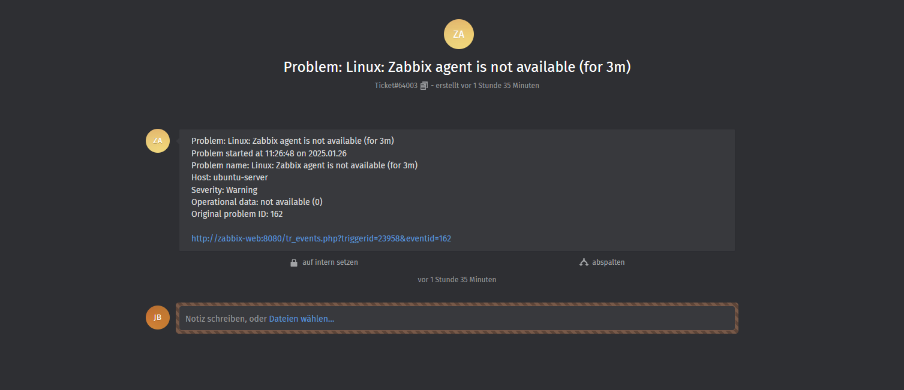

# Auswertung

## :green_book: - Sind alle Ziele erreicht worden?
| :checkered_flag: Ziele                                                                                                     |
| -------------------------------------------------------------------------------------------------------------------------- |
| - Das Ticketsystem erfolgreich implementieren und Betriebsbereit machen :white_check_mark:                                 |
| - Das Ticketsystem muss mit den definieren Benutzerzugängen für die Kundensimulation erreichbar sein.   :white_check_mark: |
| - Bei Absturz des zu überwachenden Systems muss automatisch ein Ticket generiert werden :white_check_mark:                 |

- Das Ticketsystem erfolgreich implementieren und Betriebsbereit machen :white_check_mark:

---

- Das Ticketsystem muss mit den definieren Benutzerzugängen für die Kundensimulation erreichbar sein.   :white_check_mark:

- User zammad@liliagmbh ist der Ticket-Agent / Bot User , welcher den Ticket-Trigger verarbeitet.
- User james@liliagmbh ist der allgemeine Administrator der Umgebung..
(Alle Benutzerzugänge für die Kundensimulation sind separat in einem Passwortsafe abgelegt)

---

- Bei Absturz des zu überwachenden Systems muss automatisch ein Ticket generiert werden :white_check_mark:

-> Ticket-Trigger via Webhook gesendet

---

-> Generiertes Ticket innerhalb Zammad

---
Docker-Container:

- Zabbix Container:

Alle Online und erreichbar :white_check_mark:

- Zammad-Container:

Alle online und erreichbar, zammad-init ohne Fehler durchgeführt :white_check_mark:

- Ubuntu-Container:

Ubuntu-Server mit Zabbix Agent aktiv. :white_check_mark:

- Gesamte Docker-Struktur:

Alle Container online und erreichbar :white_check_mark:

:white_check_mark: Ja, alle Ziele, die ich am Anfang des Projektes definiert habe, wurden in meinem Projekt erreicht. Zudem konnte 3 anstatt wie in der Projektbeschreibung "mind. 2" ITSM Lösungen evaluieren. Projekt wurde übertroffen.
