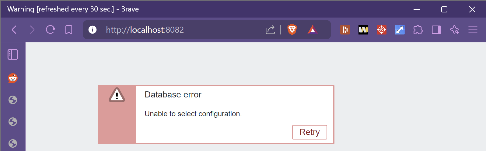
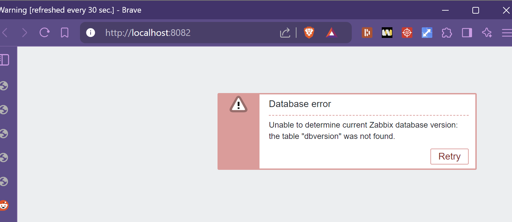
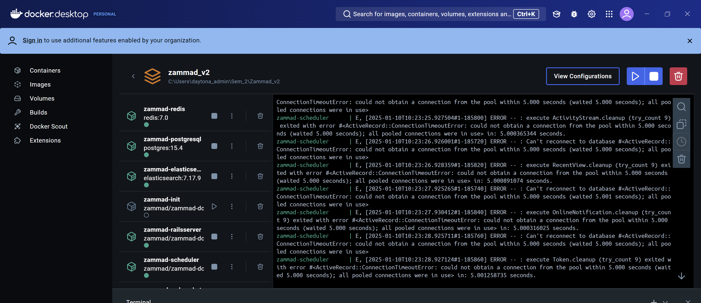
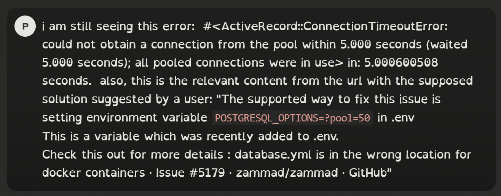
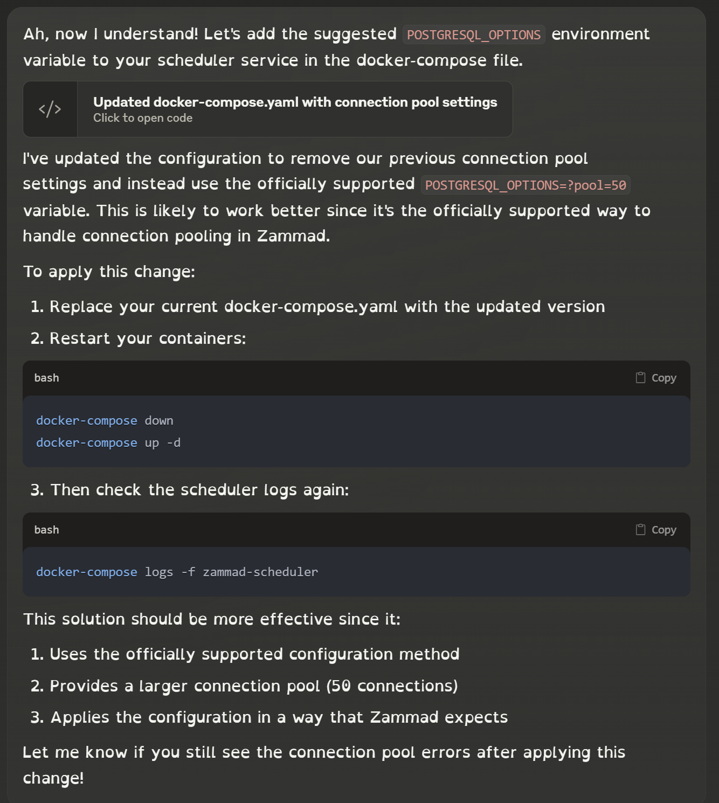
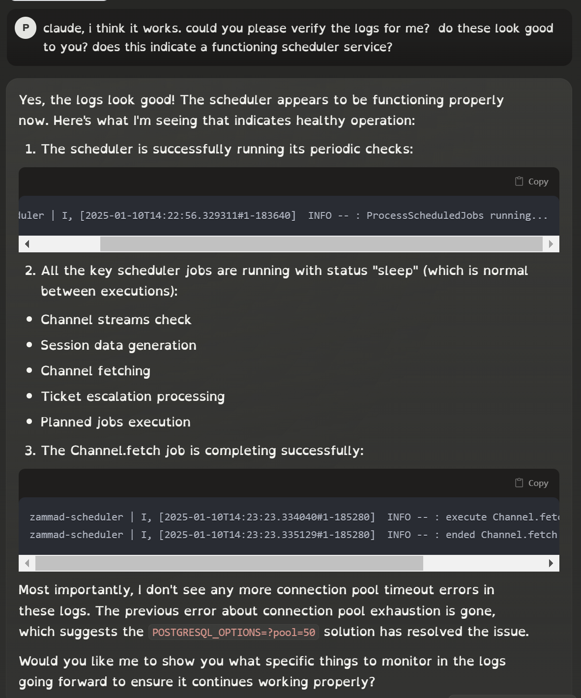
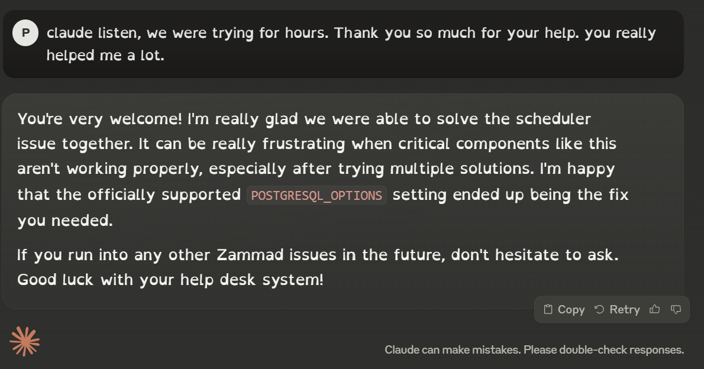

# Reflexion

## :green_book: - Was habe ich gerne gemacht und weshalb?

- Da sich der neue Projektantrag als eine super Lernmöglichkeit für mich erwiesen hat, hat es mir grossen Spass bereitet mich in das Thema Docker und Containerisierung einzulesen, sowie viel über ITIL V4 und ITSM zu lernen. Meine ITIL-Zertifizierung hat sich als sehr hilfreich erwiesen, da ich mich sehr gut im ITIL-Framework zurechtfinden kann
- Ich bin an mehreren Wochenenden zusammen mit paar Klassenkameraden in die Bibliothek gegangen, um an unseren Projekten zu arbeiten. Der gemeinsame Austausch mit meinen Klassenkameraden war hilfreich. Mir hat der gegenseitige Input gefallen. Ich konnte mich von den verschiedenen Projektarbeiten meiner Kollegen super inspirieren lassen
- Die Zusammenarbeit mit Claude AI hat mir ebenfalls Spass bereitet. Es hat sich wie ein freundlicher Programmier-Partner angefühlt. Ich konnte äusserst viel über ITSM, zusätzliches über das ITIL-Framework, Docker und Docker-Compose lernen.
- Mit hat das ITIL-Modul auch viel Freude bereitet. Die Kahoot Spiele und die Präsentationen über die verschiedenen Elemente des ITIL Framework haben mich für das Projekt optimal vorbereitet.
## :green_book: - Was gelang mir gut?

:thumbsup: Ich bin sehr Happy über die Umsetzung meines Projektes. mir geling das Zusammenspiel mit den verschiedenen Docker-Compose files sowie das aufsetzen meiner ITSM-Umgebung äusserst gut.
Ich bin sehr zufrieden mit der Persistenz meiner Umgebung. Der simple Aufbau des Netzes sowie der Trigger zum Ticketsystem sind optimal. Man kann auf dem ersten Blick erkennen, welches System von der Downtime betroffen ist.

Die Evaluation hat mir auch besonders gefallen. Ich bin vollumfänglich zufrieden mit der Zammad ITSM-Lösung und ich benutze Zammad sehr gerne. Bis zu diesem Projekt habe ich zum ersten Mal von Zammad erfahren.

Trotz des Zeitdrucks habe ich eine vollumfängliche Lösung auf die Beine gestellt. Dieses Projekt bietet auch die Gelegenheit, darauf aufzubauen. Dieses Projekt wäre ein guter Kandidat für zukünftige Projektarbeiten.

## :green_book: - Welche Schwierigkeiten / Probleme sind aufgetreten und was waren die Ursachen?

### :rotating_light: Problem 1: Häufige Datenbankfehler
Einträge falsch / Spalten fehlten / Zeilen fehlten / Zammad Scheduler Kaputt

:white_check_mark: Teils hatte ich bei den Tests mit OTRS / FREESOCUT und ZABBIX teils keine Verbindung zur eigenen Datenbank. Dies lag daran, das meine KI-Lösung inoffizielle Code-Quellen eingesetzt hat, oder schlichtweg die Datenbank-Initialisierung inkorrekt durchgeführt hat.

Da sich OTRS und FREESCOUT sowieso nicht als optimale Lösungen erwiesen haben, ist es mit Zammad relativ einfach gewesen.

Um die Zabbix-Datenbankprobleme zu lösen habe ich Claude AI zur Hilfe gebeten.

Ich lasse Claude erklären:

| 🤖 Disclamer: Diese Antwort wurde durch Claude-AI gestützt                 |
| -------------------------------------------------------------------------- |
| [Siehe diesen Link für weitere Informationen](../Quellen_und_Disclamer.md) |

Claude, wie haben wir die Datenbank-Probleme von Zabbix gelöst?
Wir haben folgende Änderungen vorgenommen:

1. Multi-Container statt Single-Container Setup
2. PostgreSQL optimiert: Verbindungspools und Timeouts angepasst
3. Zuverlässige Neustart-Richtlinien hinzugefügt
4. Scheduler-Service mit eigener Datenbank-Konfiguration

Das System ist jetzt stabil und kann Tickets aus Zabbix-Webhooks verarbeiten.

---
Der Zammad-Scheduler hatte ebenfalls Probleme. Ohne den Scheduler können keine automatischen Ticket-Prozesse stattfinden.
Beim initialen Setup von Zammad hat der Scheduler häufig Fehlermeldungen ausgegeben und seinen eigenen Docker-Pool nicht erreicht:

Ich konnte das Problem zusammen mit Claude-AI aufspüren und lösen:

### :rotating_light: Problem 2: Falsche Version von Zabbix
Version 6.0 nicht vollständig kompatibel mit Zammad / Anleitung stimmte nicht überein

:white_check_mark: Ich habe relativ spät bemerkt, dass die Online-Anleitung von Zabbix eigentlich nur für Zabbix 7.0 geeignet war. Ich habe anschliessend ein Upgrade von Zabbix 6.0 zu Zabbix 7.0 durchgeführt und ein neues Docker-Compose File erstellt.

Nach dem Upgrade hat meine Webhook-Integration funktioniert. 

### :rotating_light: Problem 3: Ticket Trigger Funktionalität
Ticket Trigger hat mehrfach nicht funktioniert / Ticket konnte nicht generiert werden / Webhook Kaputt

:white_check_mark: Dies lag im ersten Moment an der alten Version vom Zabbix.
Nach dem Upgrade hatte ich jedoch andere Probleme. Die Ursachen waren folgende:

- Der DNS Name für meinen Ubuntu-Server war im Zabbix falsch gesetzt.
- Ich habe den falschen API-Key angegeben
- Mein Zammad User hatte nicht die nötigen Berechtigungen, um Tickets zu erstellen
- Ich habe die falsche Severity für das Trigger Event im Zabbix definiert

*Ich habe praktisch jeden Fehler gemacht, den man machen kann ^^*

Nach Korrektur dieser Fehler hat mein Monitoring funktioniert und die Ticktes wurden sauber im Ticketsystem generiert.

### :rotating_light: Problem 4: Versehentliche Löschung der Zammad Volumes
Fehlerhafter Eingabe der `docker compose down -v` Befehls / Löschung meiner Daten

:white_check_mark: Ich habe Zammad wieder neu Konfiguriert
### Problem 5: Mühsames Testing der ITSM Lösungen
Docker Compose kaputt / Fehlende Kompatibilität mit Docker

:white_check_mark: Ich bin auf Zammad ausgewichen als ich realisiert habe das OTRS und FREESCOUT sich nicht für Docker eignen. Zammad war sowieso auch der Gewinner meiner Evaluation.

### :rotating_light: Problem 6: Verlust von Connectivity
Vergessen, Fixe IP-Adressen zu setzen / Fixe MAC-Adresse für den Ubuntu Server

:white_check_mark: Habe alle Docker Compose Files mit Fixen IP's bestückt.
## :green_book: - Welche Erkenntnisse ziehe ich daraus?
- Regelmässige Pausen zu machen und den Kopf durchlüften
- KI Taktisch einsetzen
- Versionierung meiner Docker-Compose Files sowie mehrere Versionen abspeichern
- Anleitungen genau durchlesen
- Offizielle Code-Quellen benutzen
- Am Ball bleiben und nicht verzweifeln
- Früh erkennen, wann man auf eine andere Lösung ausweichen muss
- Ausprobieren, ausprobieren und weiter ausprobieren.
- Mit Frustration besser Umgehen

## :green_book: - Sind alle Ziele erreicht worden?
| :checkered_flag: Ziele                                                                                                    |
| ------------------------------------------------------------------------------------------------------------------------- |
| - Das Ticketsystem erfolgreich implementieren und Betriebsbereit machen  :white_check_mark:                               |
| - Das Ticketsystem muss mit den definieren Benutzerzugängen für die Kundensimulation erreichbar sein.  :white_check_mark: |
| - Bei Absturz des zu überwachenden Systems muss automatisch ein Ticket generiert werden :white_check_mark:                |
|                                                                                                                           |

:white_check_mark: Ja, alle Ziele, die ich am Anfang des Projektes definiert habe, wurden in meinem Projekt erreicht. Zudem konnte 3 anstatt wie in der Projektbeschreibung "mind. 2" ITSM Lösungen evaluieren.

## :green_book: - Wurden die Ressourcen, das Material, die Personen, die Zeit optimal eingesetzt / Sofern ich den Zeitplan nicht einhalten konnte, weshalb war dies nicht möglich / warum habe ich mich verschätzt?

- Leider wurde mein erstes Projekt abgelehnt. Dies hat sich jedoch als riesige Lernmöglichkeit entpuppt. Dies hatte jedoch meinen Zeitplan etwas über Bord geworfen.
- Ich bin in der Phase des 1. und 2. Sprint schwer und mühsam an Covid erkrankt. Ich hatte nicht meine übliche Denk- und Lernkapazität und es war eine grosse Challenge für mich, zu denken. Dies hat sich auch auf meine Arbeit im Betrieb ausgewirkt. Ich habe viel Zeit gebraucht, um mich vollständig zu erholen. Ich habe mich erst ab dem 3. Sprint fit gefühlt und habe auch die Mehrheit meiner Projektarbeit im 3. Sprint abgewickelt. Dies hat mir enormen Zeitdruck gegeben. 
Jedoch bin ich sehr Dankbar für die Hilfe von Philipp Albrecht, welcher mir bei der Konzeption enorm viel Inspiration gegeben hat und mich beim gestalten der Struktur unterstützt hat.

- Ich hatte im Persönlichen Umfeld Challenges, welche nicht einfach waren. Die Herausforderungen haben mich während der Projektarbeit belastet, jedoch habe ich in kleinen Schritten gelernt, damit umzugehen.
- Das verfassen der Dokumentation hat sich als Zeitaufwändiger erwiesen als ich ursprünglich eingeschätzt habe. Ich bin an mehreren Wochenenden dran gewesen um meine Dokumentation abzuschliessen. Dies hat viel Energie und Zeit beansprucht.

## :green_book: - Warum bin ich mit meiner Leistung zufrieden / unzufrieden?

:thumbsdown: Ich bin etwas unzufrieden weniger Feedback während dem Projekt eingeholt zu haben als bei meiner letzten Semesterarbeit. Aufgrund der speziellen Situation sowie persönlichen Umständen war mir das nicht möglich. Ich habe dennoch mein bestes gegeben und werde weiterhin mein bestes geben. Zudem hätte ich mir auch gewünscht, meine Dokumentation noch etwas zu erweitern um der Projektarbeit noch gerechter zu werden, dies war mir aber Kapazitätsgründen nicht mehr möglich. Wie bereits erwähnt, habe ich aber mein bestes gegeben.

:thumbsup: Ich bin äusserst zufrieden mit der Lösung sowie dem Konzept. Es gibt mir ein gutes Gefühl mein ITSM wissen sowie mein neu gelerntes Wissen über Docker erfolgreich umgesetzt zu haben und meine technischen Ziele vollständig erfüllt zu haben.
 Die Umgebung läuft gut und flüssig. Alles ist erreichbar. Durch meine Arbeit habe ich mir eine Grundstein für zukünftige Semesterarbeiten bereitgestellt.
### - Was mache ich beim nächsten Auftrag anders / besser?
- Bei einer allfälligen Ablehnung meiner Projektes, vorher einen Plan B bereithalten und / oder früher einen Ersatz konzipieren
- Stress im Persönlichen Leben minimieren, damit ich so viel Kapazität wie möglich im Projekt habe
- Mehr auf meine Dozenten zugehen (Rat und Feedback einholen) und mehr Sprint-Gespräche Nutzen
- Mehr Zusammenarbeit mit meinen Klassenkameraden organisieren

## :green_book: - Wie kann ich meine Erkenntnisse in neuen Aufgaben oder in aufgedeckten Mängel berücksichtigen?

- Über die Probleme und dessen Lösungswege reflektieren. (Notizen führen, sorgfältig durch die Risiken durchgehen und diese Schritt für Schritt analysieren)
- Durch die gewonnene Erfahrung während dieses Projektes zukünftig die Risiken intrinsisch besser einschätzen
- Neu-Kennengelernte Technische Hilfsmittel für zukünftige Arbeiten einsetzten
- Durch realistisch-definierte Zeitfenster Probleme analysieren, begutachten und innerhalb der Zeitfenster bearbeiten. Wenn Zeitfenster beendet werden, reflektieren, einschätzen und nächste Schritte einleiten.

## :green_book: - Was habe ich gelernt?

- Ich habe gelernt, wann ich ein Problem als lösbar einschätzen kann und wann es sinnvoll ist, von neu anzufangen. Dies ist mir speziell beim Erstellen der Docker-Compose Files aufgefallen sowie beim testen der Verschiedenen Monitoring und ITSM-Lösungen innerhalb vom Docker.
- Ich habe gelernt, wann / wie und welche KI ich zu welchem Zeitpunkt oder Zweck benutzen kann.
Am besten hat mir die Arbeit mit Claude AI gefallen, da Claude viel besser Kontext durch ein Gespräch behalten kann. Ich konnte Stück für Stück mit Claude Troubleshooting durchführen und meine Docker-Compose Files neu gestalten. Trotzdem hat Claude wenige Flüchtigkeitsfehler gemacht. Jedoch konnte ich sie mit einem guten Auge erkennen und anschliessend intervenieren. Claude hat sich wie ein guter und zuverlässiger Programmier-Partner angefühlt der den gesamten Gesprächsverlauf stets mit einbezogen hat.

Claude hat sich gemerkt, Chatgpt hingegen schneller vergessen. Gerne möchte ich dies mit einem Beispiel beschreiben:

Chatgpt hat zwar gezeigt, wie man auf ein Goal schiessen kann aber schnell mal vergessen, dass man ein gebrochenes Bein hat. Sogar bei über 150+ Zeilen Codebase hat Claude immer verstanden, um was es geht

Claude hingegen hat das gebrochene Bein stehts mit einbezogen und mir mit einer verständlichen Erklärung gezeigt, wie ich mit meiner Situation trotzdem an mein Ziel komme und ein Goal schiessen kann. Claude hatte das Gespräch immer im Fokus und hat Kleinigkeiten nicht vergessen. Jedoch ist Kooperation immer nötig. Claude arbeitet mit ausführlichen und Detaillierten Anforderungen am besten.

## :green_book: - Danksagung :blue_heart:

- Ich möchte mich bei meinen Schulkameraden bedanken, die jeweils am Wochenende mit mir in die Bibliothek gegangen sind, um zusammen an unseren Projektarbeiten zu arbeiten.
- Ich möchte mich bei meinen Dozenten an der TBZ bedanken (Philipp 1 und Philipp 2, Caesar und Corrado) welche mich bei meiner Projektarbeit beraten haben und zur Konzeption beigetragen haben
- Zudem bei meiner Familie, welche mich mental während meiner Semesterarbeit unterstützt haben. Vielen Dank