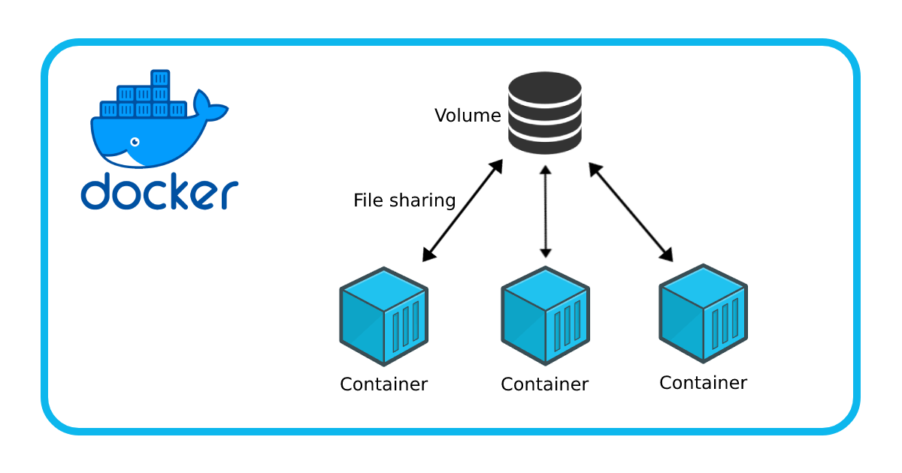

# :page_with_curl: Semesterarbeit 2
## Titel: :ticket: Self-Hosted ITSM mit Systemüberwachung via automatischer Tickets
## :bust_in_silhouette:Studierende: Lilia Mechani
## :busts_in_silhouette: Dozenzen: (PRJ) Philipp Rohr (ITSM) Ceasar Roth 
---
# 1. Einführung
## 1.1 Beschreibung

## :round_pushpin: Topics:
-  :computer: ITSM 
- :paperclip: PRJ (Projektmanagement)

Diese Semesterarbeit beinhaltet eine Evaluation von mind. 2 Ticketsystemen, wodurch das ausgewählte Ticketsystem anschliessend selbst gehostet wird und dessen Benutzerzugänge gesichert werden. Ein Server ausserhalb des Ticketsystems wird durch ein Monitoring überwacht und bei einem allfälligem Absturz durch einen automatischen generierten Incident innerhalb des Ticketsystems vermerkt. Hierbei möchte ich eine Kundenumgebung simulieren und die Theorie aus dem ITSM Modul in die Praxis umsetzen ***(Simulation einer ITSM Kundenumgebung und Testing der Lösung)

Hierbei möchte ich 
beachten, dass das Ticketsystem meinem Lehrgang gerecht ist und Cloud-Ready ist.

***Die vollständige Lösung sollte kostenfrei und Benutzerfreundlich sein sowie Kompatibilität mit meiner skalierbaren Umgebung bieten.

## :checkered_flag: Ziele
- Das Ticketsystem erfolgreich implementieren und Betriebsbereit machen 

- Das Ticketsystem muss mit den definieren Benutzerzugängen für die Kundensimulation erreichbar sein. 

- Bei Absturz des zu überwachenden Systems muss automatisch ein Ticket generiert werden

## :link: Links / Verweise:

Codebase des Projektes

Quellen und Disclamer

Reflexion

Sprint und Gantt

Bilder

## 1.2 IPERKA

### $\color{red}{\textsf{Arbeitspaket 1: Informieren}}$
 Zuerst habe ich mich der Machbarkeit dieses Projektes gewidment.

Urs

Der erste Schritt ist der Evaluation der Ticketsysteme gewidmet; sowie die Abklärung in Sachen

- Monitoringkompatibilität und einfache Integration der Monitoring-Funktionalitäten
- *****Scalability /  Orchestrierung
- Ticketing-Funktionalität
- Kostenloser Zugriff / Freie Lizenz

Das Ticketsystem soll Funktionen beinhalten, welche im Alltäglichen Support sowie im ITIL-Prozess Grundlegend sind ***(Erstellen von Tickets / Incidents, Mailverkehr, Unterteilung von Agenten, Priorisierung von Incidents)***
Zudem muss das Ticket System die Möglichkeit bieten, es auf eigener Infrastruktur zu hosten.

So kann ich das System mit SEUSAG klar eingrenzen.

#### 1.2.1 Evaluation der Ticketsysteme

Nach Suche in gängigen Suchmaschinen und Online-Plattformen sowie Wissensaustausch mit Klassenkameraden bin ich auf folgende Freeware Lösungen gestossen:
##### Zammad
....

##### OTRS
....

##### FREESCOUT
***FreeScout*** ist eine kostenfreies und open source helpdesk-Lösung welche auf PHP basiert. Freescout beinhaltet Shared Mailbox Funktionen.

| Kriterien                             | ***OS Ticket*** | ***OTRS*** | ***FREESCOUT*** |
| ------------------------------------- | --------------- | ---------- | --------------- |
| Docker-Kompatibel (Containerisierung) |                 |            |                 |
| Unterteilung von Agenten              |                 |            |                 |
| Workflows                             |                 |            |                 |
| API-Funktionalität                    |                 |            |                 |

### $\color{orange}{\textsf{ Arbeitspaket 2: Planen}}$

Geplant wir anhand Arbeitspaketen, welche in den jeweiligen Sprint-Phasen ausgeführt werden.

Um die Übersicht zu behalten, werden diese Phasen sowie die Arbeitspakete in einem ***Gantt-Diagramm*** festgehalten.

.............................................
...........................................
...............................................

#### Arbeits Pakete

...

#### Sprint-Phasen
...

#### Gantt-Diagramm
...

### ### $\color{yellow}{\textsf{ Arbeitspaket 3: Entscheiden}}$

- Vore

Nach einigen Tests innerhalb meiner Docker-Umgebung habe ich mich für folgende Lösung entschieden
- Zabbix Monitoring 
Kandidaten welche ausgeschieden wurden waren PRTG sowie Service-NOW
- Docker 
Für eine Plattform welche dem Lehrgang gerecht ist und höchste Flexibilität zur Orchestrierung der Lösung. iAC
- Zendesk Helpdesk
Für die Rasche
-
-
-

### $\color{lime}{\textsf{ Arbeitspaket 4: Realisieren}}$ 

1. Docker-Compose Files einrichten

Die Realisierung des Projektes 
#### SEUSAG Übersicht
.....

##### SEUSAG - Beschreibung

### $\color{cyan}{\textsf{ Arbeitspaket 5: Kontrollieren}}$ 
Um meine Umgebung zu testen, wird der Server via Docker heruntergefahren.

Sobald der Server nicht mehr erreichbar ist, muss automatisch ein Ticket ausgelöst werden durch den Zabbix / Zendesk Webhook.

Dieses Ticket kann einen Text beinhalten welches die nötigsten Informationen zum betroffenen System beinhaltet um anhand den Informationen allfällig Troubleshooting betreiben kann.
### $\color{purple}{\textsf{ Arbeitspaket 6: Auswerten}}$ 
Die Auswertung findet mit dem Resultat des K im IPERKA (Kontrollieren) statt.
Wenn das Ticket die korrekte Information wiedergibt und unmittelbar nach der Downtime des Servers generiert wird und auf dem Dashboard der Ticketsystems erscheint, gilt die Auswertung als erfolgreich.