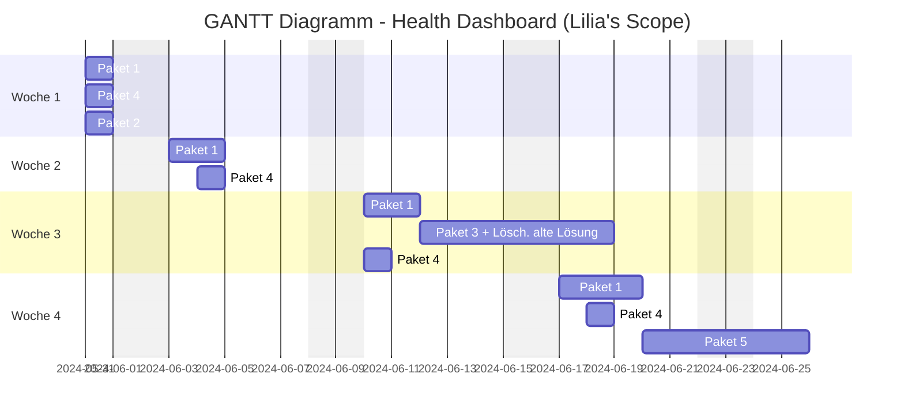

### GANTT-Diagramm

```mermaid

gantt
    dateFormat  YYYY-MM-DD
    title       GANTT Diagramm - Health Dashboard (Lilia's Scope)
    excludes    weekends
    %% (`excludes` accepts specific dates in YYYY-MM-DD format, days of the week ("sunday") or "weekends", but not the word "weekdays".)

    section Woche 1
    Paket 1:  des1, 2024-05-31, 1d
    Paket 4              :       2024-05-31, 1d
    Paket 2          :         2024-05-31, 1d

    section Woche 2
    Paket 1             : des1, 2024-06-03, 2d
    Paket 4 : 2024-06-04, 1d

    section Woche 3
    Paket 1   :des1, 2024-06-10, 2d
    Paket 3 + Lösch. alte Lösung              :         des2, after des1, 5d
    Paket 4              :         2024-06-10, 1d

    section Woche 4
    Paket 1               :  des2, 2024-06-17, 3d
    Paket 4               :        2024-06-18, 1d
    Paket 5              :         des3, after des2, 4d


```

Das GANTT Diagramm beschreibt den Zeitrahmen der definierten Arbeitspakete. Das Diagramm war ein intergraler Teil meiner Planung
